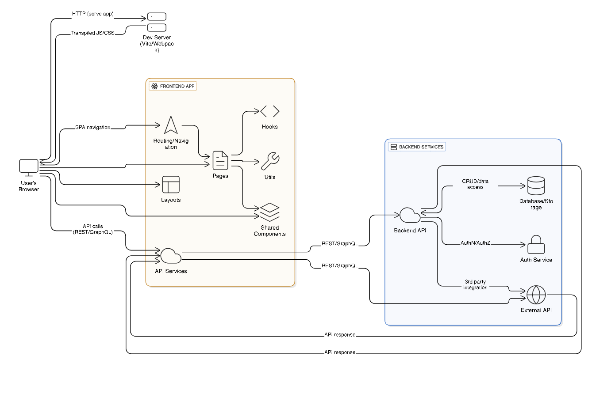

# Xeno Frontend

Frontend for **Xeno** — a React + Vite web application.

---

## Table of Contents

- [Xeno Frontend](#xeno-frontend)
  - [Table of Contents](#table-of-contents)
  - [About](#about)
  - [Local Setup Instructions](#local-setup-instructions)
  - [Architecture](#architecture)
  - [Tech Stack \& AI / Tools Used](#tech-stack--ai--tools-used)
  - [Known Limitations / Assumptions](#known-limitations--assumptions)

---

## About

This is the frontend portion of the *Xeno* project. It is built using React and Vite, uses ESLint for linting, and is structured to allow fast development with hot module reloading. Some utility and styling code (CSS/HTML) are included as needed.  

---

## Local Setup Instructions

Follow these steps to run the project locally:

1. **Clone the repository**

   ```bash
   git clone https://github.com/DhruvAgrawal511/xeno-frontend.git
   cd xeno-frontend
`

2. **Install dependencies**

   Ensure you have Node.js (preferably current LTS) installed. Then run:

   ```bash
   npm install
   

3. **Start the development server**

   ```bash
   npm run dev
   

   This will launch the app locally with Vite, often at `http://localhost:5173` (or whatever port Vite picks).

4. **Building for production**

   To build the production bundle:

   ```bash
   npm run build
   

   The output will usually be under the `dist/` folder (or as per configuration in `vite.config.js`).

5. **Preview production build**

   To preview what production will look like:

   ```bash
   npm run preview
   

6. **Linting**

   To check for lint errors:

   ```bash
   npm run lint
   

7. **Other helpful scripts**

   If present, e.g. formatting or test scripts, run as needed:

   ```bash
   npm run format
   npm test
   

---

## Architecture

Below is a high‑level overview of the architecture of the frontend.




* **Public** folder serves static assets: icons, images, index.html etc.
* **src** folder contains application code: React components, styles, utilities.
* **ESLint config** enforces code quality / styling.
* **Vite** handles bundling, dev server, HMR (Hot Module Replacement).

---

## Tech Stack & AI / Tools Used

Here’s a summary of the main technologies, libraries, and any AI tools involved (if any):

| Category                              | Tools / Libraries                                                                                                                         | Purpose                                                |
| ------------------------------------- | ----------------------------------------------------------------------------------------------------------------------------------------- | ------------------------------------------------------ |
| **Framework / Build**                 | React, Vite                                                                                                                               | Core frontend framework + fast build / dev environment |
| **Linting / Code Quality**            | ESLint                                                                                                                                    | Enforce coding standards, avoid errors                 |
| **HTML / CSS**                        | CSS, possibly any CSS framework (if present)                                                                                              | Styling UI                                             |
| **Javascript Utilities**              | Typical JS helper modules, possibly for API calls, state, etc.                                                                            | Abstraction etc.                                       |
| **Deployment / Hosting**              | Vercel (based on URL shown: `xeno-frontend-gamma.vercel.app`)                                                                             | Hosting the frontend production build                  |


---

## Known Limitations / Assumptions

These are some limitations, assumptions or potential improvements to keep in mind:

* **Assumptions**

  * Backend or API endpoints are available, stable, and secure. The frontend assumes certain endpoints and data formats.
  * Environment variables (if any) are correctly set up in local and production environments.
  * Static assets (images, icons) will be served from `public` directory or via configured paths.

* **Limitations**

  * No TypeScript: the code (as visible) is in JavaScript. Type safety might be lacking.
  * Lack of strong test coverage (unit tests / integration tests) visible in the repo.
  * Potential missing responsive UI / styling adjustments for different screen sizes (if CSS has not been optimised).
  * Error handling might be minimal (e.g. API failures, network issues) unless explicitly coded.
  * Accessibility (a11y) may not be fully addressed (ARIA labels, keyboard navigation, etc.).

* **Future Possible Improvements**

  * Add TypeScript for static typing.
  * Add automated tests (unit, e2e).
  * Improve performance (code‑splitting, lazy loading).
  * Add internationalization / theming support if needed.
  * More robust error / connection offline handling.


